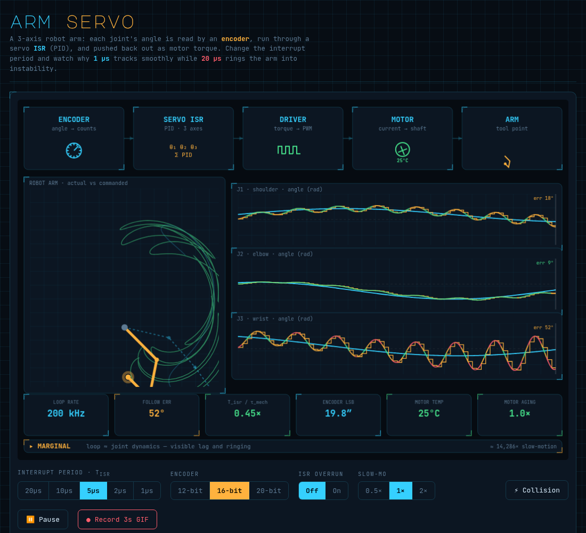

# Arm Servo — 3-Axis Motor Control Visualizer

A single-file interactive explainer for a **3-axis robot arm servo loop** — the motor-control sibling of the [ISR loop / GaN visualizer](https://kylefoxaustin.github.io/isr-loop-viz/).

> **each joint's angle is read by an encoder → a servo ISR (PID) computes torque → the motor driver pushes it out → the joint moves → forward kinematics gives the tool point**

Same lesson, new domain: *the interrupt period isn't a "speed" knob — it decides whether the arm tracks its command or rings itself into instability.* Slide the ISR period from **20 µs** to **1 µs** and watch the three joints go from a flailing, limit-slamming mess to silky tracking.



## Why a slow loop wrecks a servo

Unlike the power-rail case (where a slow loop just *droops*), a position loop has its own dynamics, so a slow loop is actively **dangerous**:

- The sampled controller adds **delay** (zero-order hold + one-period transport delay). That delay eats the loop's **phase margin**.
- Once the loop period is large relative to the joint's mechanical time constant, the closed loop **rings**, then goes **unstable** — the arm oscillates harder and harder until it slams its hard stops.

The model is a sampled **PD controller** on a 2nd-order joint (`J·θ̈ + b·θ̇ = τ`, `τ = Kp·e − Kd·θ̇`), tuned so:

| T_isr | T_isr / τ_mech | behavior | verdict |
|------:|:--------------:|:---------|:--------|
| 1–2 µs | ≤0.18× | crisp tracking | **SMOOTH** |
| 5 µs  | 0.45× | visible ringing | **MARGINAL** |
| 10–20 µs | ≥0.9× | rings → slams the stops | **UNSTABLE** |

### "But real MCUs run motors at 20 µs just fine!"

They do — because **it's the ratio that matters, not the absolute 20 µs.** Real motor/joint mechanics have time constants of ~ms, so a 20 µs loop is *hundreds* of times faster than the plant — deep in the SMOOTH regime. Our toy joint defaults to an artificially stiff **τ_mech ≈ 11 µs** to put the instability on a 1–20 µs axis. Slide the **Joint τ_mech** control up (11 µs → 0.1 ms → 1 ms) and watch the `STABLE ≤` readout climb (≤9 µs → ≤90 µs → ≤0.9 ms) and the 20 µs verdict flip **UNSTABLE → SMOOTH**. (Real designs also help themselves with cascaded current/velocity/position loops at different rates, FOC, PWM-synced sampling, and observer-based velocity instead of a raw sampled derivative.)

## What it shows

- **Pipeline** — encoder → servo ISR (3 axes) → driver → motor (heats up) → arm.
- **Robot arm** — the 3-link arm at its actual pose (colored by health), a faint **commanded ghost** arm, and the tool-point trail (actual vs commanded). At 1 µs they overlap; at 20 µs the actual path is chaos.
- **3 joint scopes** — per axis: commanded angle (cyan), encoder sample-and-hold (amber), and the actual angle colored by following error (green→amber→red). Independent profiles per joint.
- **Metrics + verdict** — loop rate, worst following error, `T_isr/τ_mech`, encoder LSB, motor temperature, motor aging, and a SMOOTH / MARGINAL / UNSTABLE verdict.

## Cascade mode (the capstone)

Switch **View → Cascade** for the single-axis **nested-loop** model that's how real drives actually work: a slow outer **position** loop wrapped around a fast inner **current** loop, with two independent plants.

```
θcmd ─►[POSITION PD @ T_pos]─► i_cmd ─►[CURRENT PI @ T_cur]─► V ─► motor
         (outer, ~kHz, ms plant)         (inner, ~10–100 kHz, µs plant)   │
            ▲ θ  (mechanical: J·θ̈ = Kt·i − b·θ̇)                            │
            └──────────────── i  (electrical: L·di/dt = V − R·i − Ke·ω) ◄──┘
```

Two scopes at two timebases — **position (ms window)** and **current (µs window)** — and a dual verdict (outer / inner). The lesson you can drive with the two rate knobs:

- **Both fast** (e.g. T_pos 200 µs, T_cur 5 µs) → position SMOOTH, current TIGHT.
- **Slow inner loop** (T_cur 20 µs) → the current loop oscillates (big ripple) and starves the position loop of usable torque — *everything* breaks, even though the position loop rate is fine. (This is the GaN/power-rail lesson living inside the motor.)
- **Slow outer loop** (T_pos 1 ms) → the position loop rings into instability **even with a perfectly tight current loop**.

The takeaway: **each loop must be fast enough for its own plant.** A fast current loop can't rescue a too-slow position loop, and a fast position loop is useless on top of a broken current loop. That's why drives are cascaded — and why "1 µs class" rates belong to the *current* layer, not position.

## Controls

- **Interrupt period `T_isr`** — 20 / 10 / 5 / 2 / 1 µs.
- **Encoder** — 12 / 16 / 20-bit (resolution → `ENCODER LSB`, in ° / arcsec).
- **Joint τ_mech** — 11 µs / 45 µs / 0.1 ms / 1 ms. Scales the joint's mechanical time constant (the plant slows, gains rescale to keep the loop well-tuned). Proves stability is set by **T_isr / τ_mech**: a slow, realistic joint is rock-solid at 20 µs. The `STABLE ≤` chip shows the max loop period that stays controllable.
- **ISR overrun** — Off / On. The ISR now runs **3 axes per tick**, so the compute budget is tight: a 1 µs loop occasionally blows its deadline even idle, and a collision blows a burst. Blown deadlines = the update is dropped (motor holds), drawn hatched magenta.
- **View** — **Arm · 3-axis** (single-loop joints) ↔ **Cascade · 1-axis** (nested position + current loops). Cascade mode swaps in **Position loop** / **Current loop** rate selectors.
- **Slow-mo** — 0.5× / 1× / 2×.
- **⚡ Collision / Load disturbance** — in Arm mode, knock a random joint with an impulse torque (recovers at 1 µs, can diverge at 20 µs). In Cascade mode, apply a load-torque disturbance the loops must reject.
- **Pause**, **● Record 3s GIF** (downloads `arm-servo-<period>us.gif`).

## Motor heating

Heat ∝ Σ torque² with thermal mass (it heats/cools on a time constant). A smooth loop barely warms the motors; an unstable loop saturates the torque and **cooks them** — temperature and an aging multiplier climb. Same idea as the battery in the GaN visualizer.

## Running it

Just open `index.html`. No build, no dependencies, no network. Keep `vendor/` next to it. (`gif.js` is vendored and the worker is base64-inlined, so recording works from `file://`.)

## License

MIT — see `LICENSE`.

TTA
